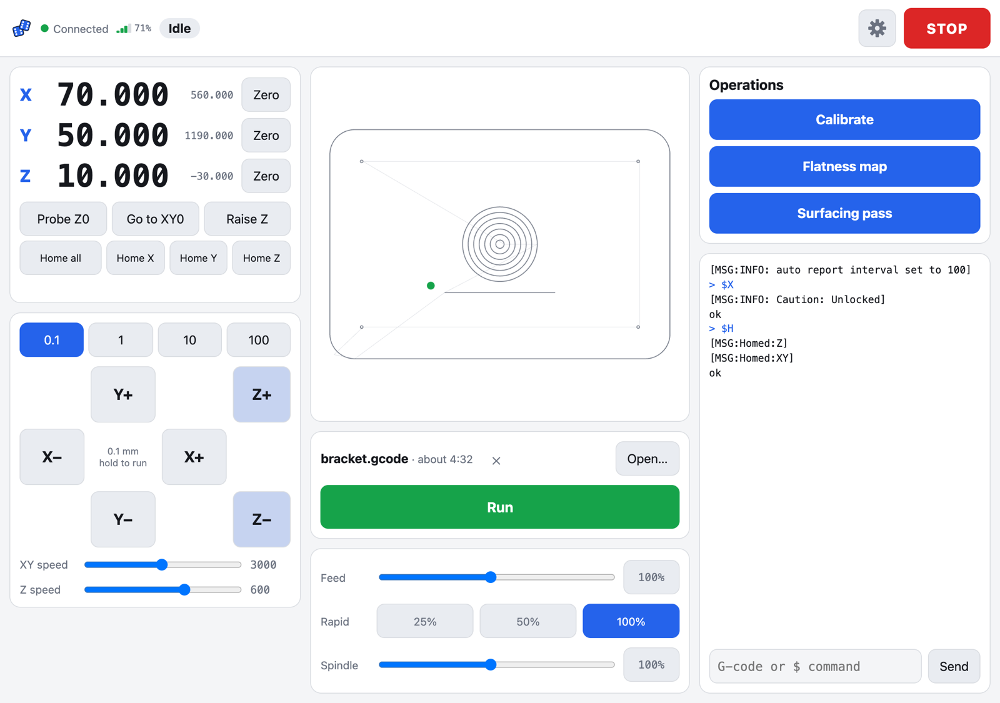

# HighRoller

A phone-and-desktop web UI for a FluidNC-driven CNC router (built for a LowRider v4 on a Jackpot board, FluidNC 3.9.9). It ships as one gzipped HTML file on the controller's own flash, so nothing else needs to run.

What it does: jog pad with hold-to-run, STOP (hold, then reset), console, SD card browser with folders, job runner with a toolpath preview in machine coordinates and a time-left estimate that learns the real speed, feed/rapid/spindle overrides, touch-plate Z zero, and one calibration routine (four V-bit dots on tape → one measuring session → Z tilt, squareness and steps/mm written to the config, with a `.bak` of the old one).



*The desktop layout with a job loaded, on the fake controller. On a phone the same panels become four tabs.*

## Develop against the fake controller

```bash
npm install
npm run fake      # fake FluidNC on :8081 (websocket, SD card, flash, probe); also serves the last build at /
npm run dev       # Vite on :5173, proxying file requests to the fake
npm test
```

The fake answers `curl -X POST localhost:8081/fake/touch` (tap the plate to the bit) and `curl -X POST 'localhost:8081/fake/plate?z=-2'` (where the plate sits, machine Z).

## Develop against the real board

```bash
VITE_FLUIDNC_HOST=192.168.1.50 npm run dev   # your board's address
```

Then open `http://<this computer>:5173` on the phone. The app talks to the board's websocket directly; file requests go through Vite's proxy to the same host.

## Put it on the board

```bash
npm run build     # dist/index.html.gz, about 64 KB
```

Upload `dist/index.html.gz` to the board's flash through the stock WebUI (the FluidNC file manager), first under another name such as `highroller.html.gz` and open `http://fluidnc.local/highroller.html`; once you trust it, upload it as `index.html.gz` to replace the stock WebUI (keep a copy of the stock file first). The board's flash filesystem is 192 KB on a Jackpot and the stock WebUI takes about 100 KB of it; `$LocalFS/List` shows the room left.

## Layout

- `src/lib/fluidnc.js` is the only module that touches the websocket; everything else goes through `fnc.send()` and the named helpers.
- `src/lib/*.svelte.js` hold the app state (machine, job, settings); components live in `src/components`.
- `dev/fake-fluidnc.js` models the parts of FluidNC 3.9.9 the app relies on, and the tests run against it.
- `docs/superpowers/specs` holds the design; `docs/superpowers/plans` the build plans; `TODO.md` what is deferred past 1.0.

## License

[MIT](LICENSE).
